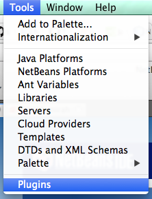
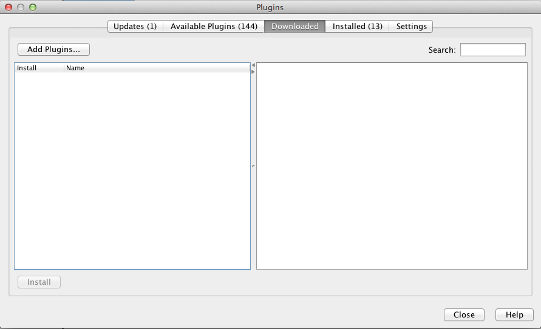
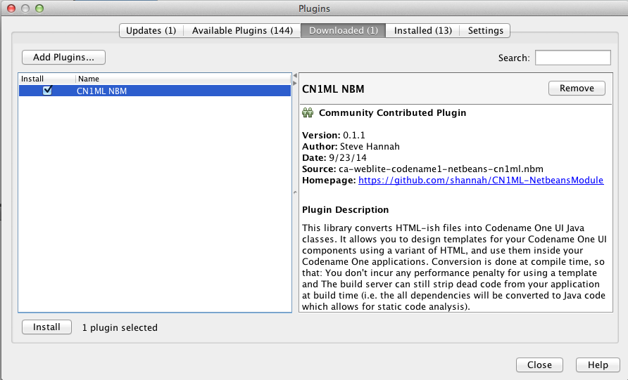

#CN1ML NetBeans Module

##Codename One Templates using HTML

##Synopsis

This library converts HTML-ish files into Codename One UI Java classes.  It allows you to design templates for your Codename One UI components using a variant of HTML, and use them inside your Codename One applications.

Conversion is done at compile time, so that:

1. You don't incur any performance penalty for using a template and
2. The build server can still strip dead code from your application at build time (i.e. the all dependencies will be converted to Java code which allows for static code analysis).

##Motivation

Codename One already has a fantastic WYSIWYG GUI builder.  Why is this even necessary?  In fact the resource files edited and generated by the GUI builder can be exported to XML.  So why bother with this templating library?

I created this library because sometimes I want to express my UI structure using code or text.  The XML produced by the resource editor is not meant to be edited by humans.  Using Java directly to describe a component hierarchy quickly turns into a mess that is difficult to maintain.  I wanted a format that was simple to be hand-coded, and provided a simple birds-eye view of the UI component hierarchy.

##License

[Apache 2.0](http://www.apache.org/licenses/LICENSE-2.0.txt)

##Installation

1. Download the [CN1ML Netbeans Module](https://s3.amazonaws.com/download.weblite.ca/cn1ml-nbm/ca-weblite-codename1-netbeans-cn1ml.nbm)
2. Open Netbeans, and select "Tools" > "Plugins"
	
	
	
3. In the "Plugins" dialog, select the "Downloaded" tab, and click the "Add Plugins..." button.

	

4. In the file chooser, navigate to and select the "ca-weblite-codename1-netbeans-cn1ml.nbm" file that you downloaded in step one.

	

5. Make sure the CN1ML NBM module is listed in the "Plugins" dialog and that its checkbox is checked.  Then click the "Install" button.
	
	
	
6. Follow the prompts and restart the IDE when asked.

##Usage

1. 