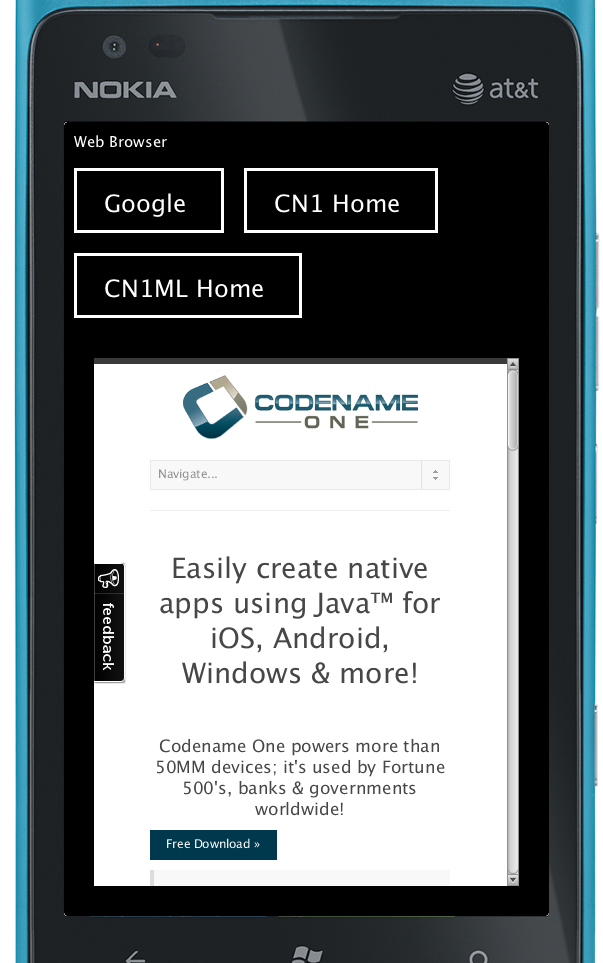

## CN1ML Sample: A Web Browser

[Return to Samples](../../README.md#more-samples)

This sample is part of the [CN1MLDemos](../../CN1MLDemos) project. 

Some things to notice in this sample:

1. Embedded `
    </head>
    <body layout="BorderLayout">
        

            <button name="google">Google
                
            </button>
            <button name="cn1">CN1 Home
                
            
            </button>
            <button name="cn1ml">CN1ML Home
                
            </button>
        

        

            
        

    </body>
</html>
~~~

### Resulting Java Source:

From [WebBrowser.java](../../CN1MLDemos/src/ca/weblite/codename1/cn1ml/demos/WebBrowser.java)

~~~
/* THIS FILE IS AUTOMATICALLY GENERATED-- DO NOT MODIFY IT*/
package ca.weblite.codename1.cn1ml.demos;

import com.codename1.ui.events.*;
import com.codename1.ui.*;

import com.codename1.ui.layouts.*;
import com.codename1.ui.table.*;
import com.codename1.ui.util.*;

class WebBrowser {

    private Container rootContainer;
    private Resources resources;

    public Container getRoot() {
        if (rootContainer == null) {
            try {
                rootContainer = buildUI();
            } catch (Exception ex) {
                ex.printStackTrace();
                throw new RuntimeException(ex.getMessage());
            }
        }
        return rootContainer;
    }
    private java.util.Map<String, Component> _nameIndex = new java.util.HashMap<String, Component>();

    public Component get(String name) {
        getRoot();
        return _nameIndex.get(name);
    }

    public WebBrowser(java.util.Map context) {
        for (Object o : context.values()) {
            if (o instanceof Resources) {
                resources = (Resources) o;
            }
        }
    }

    private Container buildUI() throws Exception {
        Container root = new Container();
        BorderLayout rootLayout = new BorderLayout();
        root.setLayout(rootLayout);
        Container node1 = new Container();
        FlowLayout node1Layout = new FlowLayout();
        node1.setLayout(node1Layout);
        Button node2 = new Button();
        node2.setName("google");
        _nameIndex.put("google", node2);
        node2.setText("Google ");
        init1_node2(node2, node1);
        if (node1 != node2.getParent()) {
            node1.addComponent(node2);
        }
        Button node3 = new Button();
        node3.setName("cn1");
        _nameIndex.put("cn1", node3);
        node3.setText("CN1 Home ");
        init2_node3(node3, node1);
        if (node1 != node3.getParent()) {
            node1.addComponent(node3);
        }
        Button node4 = new Button();
        node4.setName("cn1ml");
        _nameIndex.put("cn1ml", node4);
        node4.setText("CN1ML Home ");
        init3_node4(node4, node1);
        if (node1 != node4.getParent()) {
            node1.addComponent(node4);
        }
        if (root != node1.getParent()) {
            root.addComponent(BorderLayout.NORTH, node1);
        }
        com.codename1.components.WebBrowser node5 = new com.codename1.components.WebBrowser();
        node5.setName("browser");
        _nameIndex.put("browser", node5);
        init4_node5(node5, root);
        if (root != node5.getParent()) {
            root.addComponent(BorderLayout.CENTER, node5);
        }
        return root;
    }

    public Button getGoogle() {
        return (Button) get("google");
    }

    private void init1_node2(Button self, Container parent) {

        self.addActionListener(new ActionListener() {
            public void actionPerformed(ActionEvent e) {
                getBrowser().setURL("http://google.com");
            }
        });

    }

    public Button getCn1() {
        return (Button) get("cn1");
    }

    private void init2_node3(Button self, Container parent) {

        self.addActionListener(new ActionListener() {
            public void actionPerformed(ActionEvent e) {
                getBrowser().setURL("http://codenameone.com");
            }
        });

    }

    public Button getCn1ml() {
        return (Button) get("cn1ml");
    }

    private void init3_node4(Button self, Container parent) {

        self.addActionListener(new ActionListener() {
            public void actionPerformed(ActionEvent e) {
                getBrowser().setURL("https://github.com/shannah/CN1ML-NetbeansModule");
            }
        });

    }

    public com.codename1.components.WebBrowser getBrowser() {
        return (com.codename1.components.WebBrowser) get("browser");
    }

    private void init4_node5(com.codename1.components.WebBrowser self, Container parent) {

        self.setURL("http://www.codenameone.com/");

    }
}

~~~

### Usage

From: [CN1MLDemo.java](../../CN1MLDemos/src/ca/weblite/codename1/cn1ml/demos/CN1MLDemo.java)

~~~
    private void showWebBrowser(){
        WebBrowser m = new WebBrowser(newContext());
        createForm("Web Browser", m.getRoot()).show();
    }
~~~

### Screenshots

